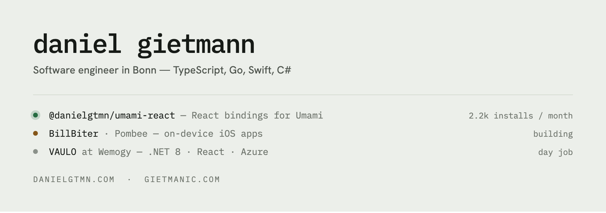

<picture>
  <source media="(prefers-color-scheme: dark)" srcset="assets/banner-dark.png">
  
</picture>

Before software I spent six years in emergency services, which is where I
learned that the interesting part of a system is how it behaves at 3am.

Client work runs through my company, **[Gietmanic](https://gietmanic.com)**.
Everything else — side projects, open source, writing — lives at
**[danielgtmn.com](https://danielgtmn.com)**.

## Currently

**[VAULO](https://vaulo.com)** at **[Wemogy](https://wemogy.com)** — a digital
asset management system. A .NET 8 backend of roughly fifty projects behind a
React frontend, running since 2021. The largest thing I work on, and the one I
did not build alone.

Alongside that, under Gietmanic: iOS apps, and web work for clients who need
something standard software does not cover.

## Published

| Package | What it does | Downloads / month |
|---|---|---|
| [`@danielgtmn/umami-react`](https://www.npmjs.com/package/@danielgtmn/umami-react) | React bindings for Umami Analytics — hooks, event tracking, zero dependencies | ~2,200 |
| [`@danielgtmn/react-cookiebot`](https://www.npmjs.com/package/@danielgtmn/react-cookiebot) | Cookiebot consent for React, configured from env | ~20 |
| [`@danielgtmn/finom-api-client`](https://www.npmjs.com/package/@danielgtmn/finom-api-client) | Typed Node client for the Finom API — invoicing, webhooks, sandbox mode | ~15 |

Plus a handful of things that are useful without being packages:
[`docker-pg-backup`](https://github.com/danielgtmn/docker-pg-backup) (PostgreSQL
backups to S3 with a REST API),
[`go-redirect`](https://github.com/danielgtmn/go-redirect) (a 5 MB redirect
container — it is what serves gietmanic.de),
[`docker-cleanup`](https://github.com/danielgtmn/docker-cleanup) (tag retention
for OCI registries), and
[`domain-mcp`](https://github.com/danielgtmn/domain-mcp) (domain availability
over MCP, RDAP first with a WHOIS fallback).

## What I actually work with

**Languages** — TypeScript, Go, Swift, C#, Python

**Frontend** — React, Next.js, Astro, Tailwind

**Backend** — .NET, NestJS, Node, PostgreSQL, Cosmos DB, Azure Service Bus

**Infrastructure** — Docker, Terraform, Azure, Hetzner, Cloudflare

## Elsewhere

- **Email** — [hello@gietmanic.com](mailto:hello@gietmanic.com)
- **Site** — [danielgtmn.com](https://danielgtmn.com)
- **LinkedIn** — [danielgtmn](https://linkedin.com/in/danielgtmn)
